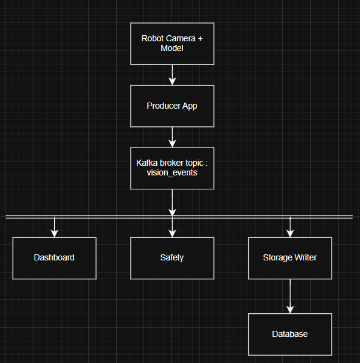

1.)

Read through the material in itslearning and watch the video about using
Kafka in applications before completing the rest of the exercises for this
assignment.

Done

2.)

Think of a use case for Apache Kafka. What kind of components would
the system consist of? How would you connect the components? What would you
use to store the data?

As a solution, draw a block diagram of the system showing the data flow
between components. Write a short explanation describing the use case and
how the system works.

Decided to make a use case of modern humanoid warehouse robots in a simple scenario.
Robots will have a camera and detect humans, boxes, forklifts and walls. Robot will send a
small JSON detection event every second. I want to show live status and save the event for later
for analysis such as safety, performance, training or even as a backlog for accidents.

Components it will have include a producer, will call it robot perception app that creates detection events,
kafka broker, that will store events in a topic, consumers, that will be used like a dashboard
as in a live view, a saftu service that will alert if something is too close, and also a storage service like a DB.
Also, a storage such as PostgreSQL.

Diagram:

It would in a wya that the robot hence the producer would send detection events to a kafka topic. Kafka will store the events and will allow many consumers to read the events independently. One consumer as seen in the diagram will build a dashboard, one will create alerts, and one will store data for later analysis etc.

3.)

Kafka uses timestamps as part of the storage strategy. Explain the
challenges of choosing which timestamp to use. Is the data being stamped by
the broker, or the producer? Consider both use cases and discuss why one is
better than the other.

As a solution, write the considerations from both points of view in your own
words. You can, for example, consider consequences of network latency or
different timezones have.

Kafka messsages do have a timestamp, the trickier part is what that timestamp will or should mean and represent.

The Producer timestamp is the event time, in our case for example is the moment the robot actually saw the object. An issue could arise here by the robot clock being wrong or the device might have some different time settings.

The broker timestamps is the arrival time of the message to it. This is more reliable compared to the producer timestamp as it is consistent, it has one official let's say clock. An issue that could arise here is with the network delay, it can make events look later than they really happened.

I think it depends on the scenario Kafka is being used. In this scenario, the producer event time is better as I care more about when the robot actually detencted the obeject and it would only work if the robot clock is accurate.